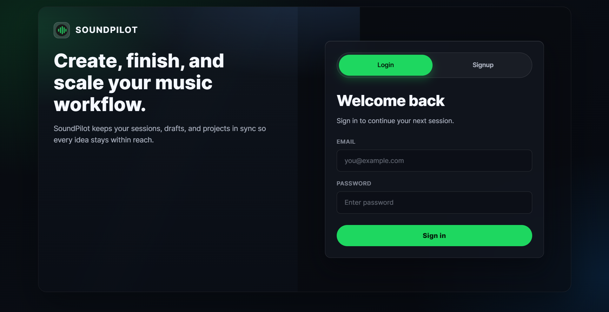

# SoundPilot 🎵

> A personal music operating system for independent artists and producers.
> Built local-first. Zero cloud. Zero cost. Zero compromise.



---

## What is SoundPilot?

SoundPilot is a full-stack desktop web application that gives musicians a private, intelligent home for their music — between the DAW and the release.

Most producers have hundreds of files scattered across folders with no system. SoundPilot organizes, analyzes, and coaches you using your own catalog data. No subscriptions. No internet required. No AI APIs. Everything runs on your machine.

**DAW → SoundPilot → Release**

---

## Features

### 🎵 Music Library
- **Upload audio files** (MP3, WAV, FLAC, AAC)
- **Automatic BPM detection** and key estimation via Web Audio API + Meyda.js
- **Auto-tagging engine** generates tags like `#dark`, `#chill`, `#hype` from audio analysis
- **Smart library search** with advanced syntax:
  `bpm:90-120   energy:high   tag:dark   genre:hip-hop   unfinished:true`
- **Inline metadata editing** (title, version, notes)
- **Delete songs** with file cleanup from disk and all linked records
- **Play count tracking** per song

### 🎧 Waveform Player
- **Full waveform visualization** powered by WaveSurfer.js
- **Seekable progress bar**, loop toggle, volume control
- **Persistent bottom player bar** across all pages
- **Song info display** with BPM and version

### 🧠 Rule-Based Intelligence Engine
- **Zero AI APIs** — all insights are computed from rules and patterns
- **Plugin architecture**: drop a `*Rules.js` file into `/plugins` to extend the engine
- **Included plugins**: Mixing Coach, Songwriting Coach, Career Coach, Marketing Coach
- **Triggers** on upload and play events
- **Logs** all insights to database for the Coach feed

### ✍️ Lyric Helper
- **Full in-app lyric writing workspace**
- **Song structure templates**: Verse-Chorus, AABA, Hook-First, Extended
- **Live syllable counter** per line
- **Rhyme scheme detector** (ABAB, AABB etc.)
- **Phonetic family rhyme engine** with 1500+ word dictionary
- **Perfect, Near, and Slant** rhyme categories
- **Works with any word** including slang and compound words
- **Writing prompt generator** per section type
- **Autosave** on every keystroke (500ms debounce)
- **Link drafts** to songs in your library

### 📁 Projects
- **Create projects** to group songs into albums, EPs, or collections
- **Project Health Score** — computed from song count, status, recency, and replay signals
- **Status workflow**: Active → In Progress → Mastering → Complete
- **Add and remove songs** per project
- **Days since last activity tracking**

### ✨ AI Producer (Rule-Powered)
- **Overview Tab**: Growth Score (0–100) with 5-category breakdown
- **Patterns Tab**: Detected creative patterns from your catalog
  - *Tempo Lock, Demo Hoarder, Energy Plateau, Hidden Gem, Upload Rhythm and more*
- **Timeline Tab**: Week-by-week creative history with milestone markers
- **Plugins Tab**: Live registry of all loaded rule plugins

### 🧬 Creative DNA Profile
- **Computed producer identity** from your real catalog data
- **Primary Style, Tempo Identity, Session Style, Completion Rate**
- **Signature Key, Avg BPM, Producer Type** label
- **Growth Score widget** with animated SVG ring

### 📊 Coach
- **Grouped insight feed** — one card per rule type with affected track count
- **Filterable by type**: All / Suggestions / Warnings / Insights
- **Weekly snapshot**: uploads, plays, active projects, most active day
- **Auto-refreshes** every 30 seconds

### 🔔 Smart Notifications
- **Rule-based nudges**: dry spells, hidden gems, demo overload, streaks, milestones
- **In-app notification bell** in sidebar with unread count
- **Zero browser popups** anywhere in the app

### 🔍 Explore
- **Songwriting**: Song structure, melody, lyrics, workflow tips
- **Mixing**: Fundamentals, EQ, dynamics, space and width
- **Mastering**: Preparation, processing chain, translation
- **Ideas**: Genre Mashup Generator, Song Concept Generator, Chord Progression Generator, Track Title Generator

---

## Tech Stack

| Layer | Technology |
|---|---|
| **Frontend** | React 18, Vite, Tailwind CSS |
| **Backend** | Node.js, Express |
| **Database** | SQLite via better-sqlite3 |
| **Audio Analysis** | Meyda.js, Web Audio API |
| **Waveform** | WaveSurfer.js |
| **Storage** | Local filesystem |
| **Intelligence** | Rule engine + JSON plugins |
| **Cost** | $0 |

---

## Project Structure

```text
soundpilot/
├── server.js                  # Express entry point
├── vite.config.js             # Vite + proxy config
├── nodemon.json               # Auto-restart config
├── package.json
│
├── db/
│   ├── schema.sql             # SQLite table definitions
│   ├── init.js                # DB initialization + export
│   └── database.sqlite        # Local DB file (gitignored)
│
├── routes/
│   ├── songs.js               # Upload, fetch, update, delete songs
│   ├── projects.js            # Project CRUD + song linking
│   ├── rules.js               # Rule logs + notifications
│   ├── lyrics.js              # Lyric drafts + sections + tools
│   └── producer.js            # Pattern engine + growth score + plugins
│
├── services/
│   ├── ruleEngine.js          # Core rule evaluator
│   ├── patternEngine.js       # Catalog pattern analysis
│   ├── lyricEngine.js         # Rhyme engine + syllable counter
│   ├── autoTagger.js          # Auto-tag generator
│   └── notificationEngine.js  # Smart notification generator
│
├── plugins/
│   ├── index.js               # Plugin loader
│   ├── mixingRules.js
│   ├── songwritingRules.js
│   ├── careerRules.js
│   └── marketingRules.js
│
├── rules/
│   └── default_rules.json     # Core rule definitions
│
├── uploads/                   # Audio files stored here (gitignored)
│
└── src/                       # React frontend
    ├── main.jsx
    ├── App.jsx
    ├── index.css
    │
    ├── context/
    │   └── PlayerContext.jsx  # Shared audio player state
    │
    ├── components/
    │   ├── Sidebar.jsx
    │   ├── Player.jsx         # Waveform player bar
    │   ├── UploadBox.jsx
    │   ├── RuleAlert.jsx
    │   └── ToastProvider.jsx  # In-app notification system
    │
    ├── hooks/
    │   └── useWavePlayer.js   # WaveSurfer hook
    │
    ├── pages/
    │   ├── Home.jsx           # Dashboard
    │   ├── Library.jsx        # Song library + search
    │   ├── Lyrics.jsx         # Lyric writing workspace
    │   ├── Projects.jsx       # Project manager
    │   ├── Explore.jsx        # Knowledge hub + generators
    │   ├── Coach.jsx          # AI insights feed
    │   ├── Producer.jsx       # Pattern engine UI
    │   └── Profile.jsx        # Creative DNA profile
    │
    └── utils/
        ├── api.js             # All fetch helpers
        ├── audioAnalyzer.js   # BPM + key detection
        └── lyricHelpers.js    # Frontend lyric utilities
```

---

## Getting Started

### Prerequisites

- Node.js v18 or higher
- npm v9 or higher

### Installation

```bash
# Clone the repository
git clone https://github.com/YOURUSERNAME/soundpilot.git
cd soundpilot

# Install all dependencies
npm install

# Start the development server
npm run dev
```

1. Open your browser and navigate to: `http://localhost:5173`
2. The Express backend runs on port 3001. Vite proxies all `/api` requests automatically.

### First Run
On first start, the database is created automatically at `db/database.sqlite`. No setup required.

1. Go to **Dashboard**
2. Drop an audio file into the **Quick Upload** box
3. Add a title and click **Upload Song**
4. SoundPilot analyzes the track and returns instant feedback

---

## Adding a Plugin

SoundPilot's rule engine is extensible. To add your own rules:

1. Create a new file in `/plugins/` ending in `Rules.js`
2. Export this structure:

```javascript
module.exports = {
  name: 'My Plugin',
  version: '1.0.0',
  rules: [
    {
      rule_id: 'my_rule',
      trigger: 'song_upload', // or 'song_play'
      condition: { field: 'bpm', op: '>', value: 140 },
      action: {
        type: 'suggestion', // or 'insight' or 'warning'
        message: 'Your message here.'
      }
    }
  ]
}
```

3. Save the file — `nodemon` restarts the server automatically
4. Your plugin appears instantly in **Producer → Plugins**

> **Supported condition operators**: `>`, `<`, `==`, `between`  
> **Supported fields**: `bpm`, `energy`, `play_count`, `genre`, `version`

---

## Smart Library Search

The Library supports advanced filter syntax:

| Query Result | Description |
|---|---|
| `midnight` | Title contains "midnight" |
| `bpm:90-120` | BPM between 90 and 120 |
| `bpm:>130` | BPM above 130 |
| `energy:high` | High energy tracks |
| `tag:dark` | Auto-tagged as dark |
| `genre:trap` | Genre is Trap |
| `unfinished:true` | Version is v1 or Demo |
| `energy:high bpm:>120` | Combined filters |

---

## Database Schema

- **songs**: `id, title, file_path, bpm, key, energy, genre, mood, version, notes, play_count, tags, created_at`
- **projects**: `id, name, description, status, created_at`
- **project_songs**: `id, project_id, song_id`
- **rule_logs**: `id, song_id, rule_id, message, created_at`
- **lyric_drafts**: `id, title, song_id, structure, status, created_at, updated_at`
- **lyric_sections**: `id, draft_id, section_type, position, content, syllable_counts, rhyme_scheme, updated_at`

---

## Available Scripts

- `npm run dev`: Start both frontend (Vite) and backend (nodemon) concurrently.
- `npm run build`: Build React frontend to `dist/`.
- `npm start`: Run production server (serves built frontend + API).

---

## Roadmap

These features are planned but not yet built:

- [ ] Waveform loop region selection
- [ ] Session tracker (log creative sessions with timestamps)
- [ ] Release planner (song → platform → marketing timeline)
- [ ] Achievements and gamification badges
- [ ] DAW plugin integration
- [ ] Auto BPM detection improvements via Essentia.js
- [ ] Export / backup library to zip
- [ ] Dark/light theme toggle
- [ ] Mobile responsive layout

---

## Philosophy

SoundPilot was built on three principles:
1. **Local First** — Your music never leaves your machine. No accounts, no cloud, no tracking.
2. **Zero Cost** — Every dependency is free and open source. Running this app costs nothing.
3. **Rule-Based Intelligence** — Insights come from your real data and deterministic logic, not black-box AI models. You can read every rule that powers the engine.

---

## License

MIT License — free to use, modify, and distribute.

---

## Built With

- **React**
- **Vite**
- **Express**
- **better-sqlite3**
- **WaveSurfer.js**
- **Meyda.js**
- **concurrently**
- **nodemon**

---

**SoundPilot — Between the DAW and the Release.**
